  

  

  
  

 

## `~/sobre`

Estudante de **Sistemas de Informação** na **Universidade Federal do Pará (UFPA)**.
Sou persistente, determinado e gosto de colocar a mão na massa: aprendo fazendo, testando e ajustando até funcionar de verdade.

Meu foco hoje:

- **Backend** · construção de serviços, lógica de aplicações e integração entre sistemas
- **IA & LLMs** · experimentos com modelos locais e integração com aplicações
- **Android** · criação de aplicativos móveis
- **Web** · construção de páginas e aplicações web

**Idiomas:** Português (nativo) · Inglês (leitura e compreensão oral, uso diário em estudos e projetos)

 

## `~/stack`

  
  &nbsp;
  <picture>
    <source media="(prefers-color-scheme: dark)" srcset="https://cdn.simpleicons.org/ollama/ffffff" />
    
  </picture>

<table align="center">
  <tr><th align="left">Ferramenta</th><th align="left">Como uso</th></tr>
  <tr><td> &nbsp;<b>Java</b></td><td>Linguagem principal: backend, POO e estruturas de dados</td></tr>
  <tr><td> &nbsp;<b>Python</b></td><td>Automação de tarefas e testes rápidos de ideias</td></tr>
  <tr><td> &nbsp;<b>Docker</b></td><td>Isolamento de ambientes e organização de serviços</td></tr>
  <tr><td> &nbsp;<b>Git e GitHub</b></td><td>Controle de versão de projetos pessoais e da faculdade</td></tr>
  <tr><td> &nbsp;<b>Linux</b></td><td>Sistema do dia a dia, para configurar e estudar</td></tr>
  <tr><td> &nbsp;<b>Ollama</b></td><td>Rodando e testando modelos de IA localmente</td></tr>
</table>

 

## `~/projetos`

  

<!-- PROJETOS:START -->
<!-- Gerado por scripts/update_projects.py — não edite à mão. -->

  

  

  

  

  

<!-- PROJETOS:END -->

 

## `~/github`

  

  <picture>
    <source media="(prefers-color-scheme: dark)" srcset="https://raw.githubusercontent.com/vitorbatista-hub/vitorbatista-hub/output/snake-dark.svg" />
    <source media="(prefers-color-scheme: light)" srcset="https://raw.githubusercontent.com/vitorbatista-hub/vitorbatista-hub/output/snake-light.svg" />
    
  </picture>

 

  

